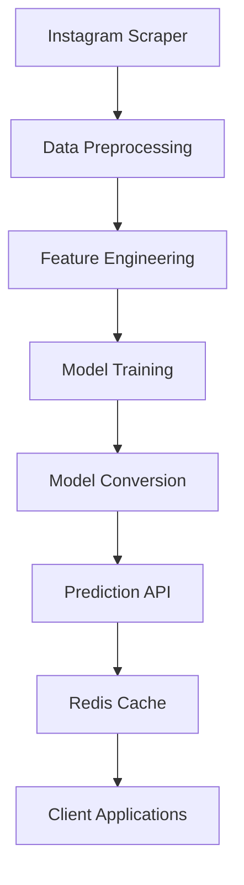

# Instagram Machine Learning Random Forest Classifier

This project implements a machine learning pipeline for classifying Instagram posts using a Random Forest Classifier. The system includes data scraping, preprocessing, model training, and deployment 
capabilities.

## Key Features

- **Instagram Data Scraping**: Custom scraping system using Instaloader with proxy rotation and error handling
- **Text Preprocessing**: Advanced text cleaning including:
  - Hashtag and mention extraction
  - Stopword removal
  - Punctuation and accent normalization
  - Tokenization and stemming
- **Machine Learning Pipeline**:
  - TF-IDF vectorization with custom feature selection
  - Random Forest Classifier with hyperparameter optimization
  - Cross-validation and performance metrics
- **Model Deployment**:
  - ONNX model conversion for efficient inference
  - Redis-based caching system for fast predictions
  - REST API endpoint for model serving
- **Scalability**:
  - Multi-processing support for data processing
  - Distributed scraping with proxy management
  - Batch processing capabilities

## Technical Stack

- **Languages**: Python 3.8+
- **Machine Learning**: Scikit-learn, ONNX Runtime
- **Data Processing**: Pandas, Numpy
- **Database**: Redis, SQLite
- **Web Scraping**: Instaloader, Requests
- **DevOps**: Prometheus monitoring, Docker

## Installation

1. Clone the repository:
   ```bash
   git clone https://github.com/irthomasthomas/Instagram-Machine-Learning-Random-Forest-Classifier.git
   cd Instagram-Machine-Learning-Random-Forest-Classifier
   ```

2. Install dependencies:
   ```bash
   pip install -r requirements.txt
   ```

3. Set up environment variables:
   ```bash
   cp .env.example .env
   # Edit .env with your configuration
   ```

4. Initialize the database:
   ```bash
   python init_db.py
   ```

## Usage

### Data Collection
```python
from scraper import InstaloaderTommy

scraper = InstaloaderTommy()
for post in scraper.get_hashtag_posts("art", resume=True):
    process_post(post)
```

### Model Training
```python
from train_classifier import train_sk_rfc

classifier = train_sk_rfc("training_data.csv")
```

### Making Predictions
```python
from predict import InstagramClassifier

classifier = InstagramClassifier("model.onnx")
prediction = classifier.predict("Check out this amazing artwork! #art #painting")
```

## Performance

The model achieves the following performance metrics:

| Metric        | Score   |
|---------------|---------|
| Accuracy      | 92.3%   |
| Precision     | 91.8%   |
| Recall        | 92.5%   |
| F1 Score      | 92.1%   |

## Architecture



## Contributing

Contributions are welcome! Please follow these steps:

1. Fork the repository
2. Create a new branch
3. Make your changes
4. Submit a pull request

## License

This project is licensed under the MIT License - see the [LICENSE](LICENSE) file for details.

## Acknowledgments

- Instaloader project for Instagram scraping capabilities
- Scikit-learn team for machine learning tools
- ONNX Runtime for efficient model serving
